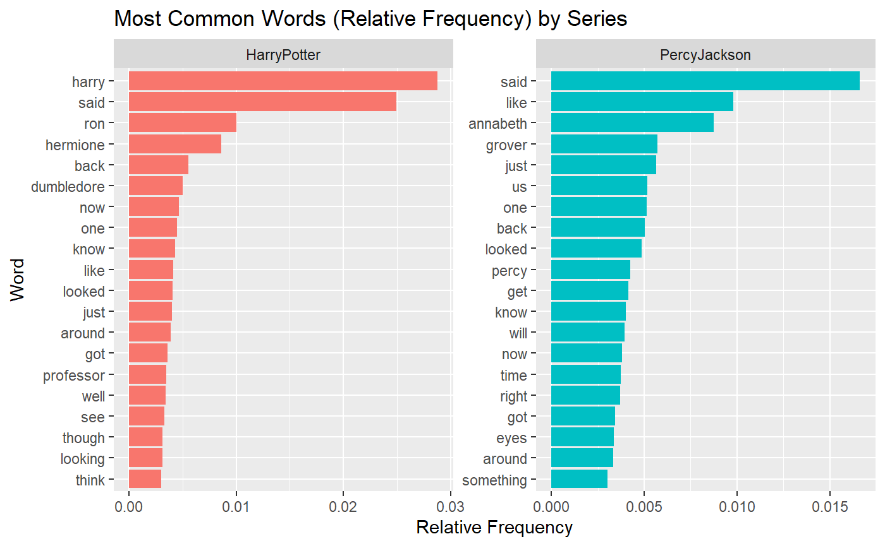

# Book Detector 

## Abstract:
  The main question that we hope to answer is: can we create an algorithm that can successfully identify what book series a paragraph is from? We will be using 2 book series: Harry Potter and Percy Jackson. In order to answer this question, we are creating a predictive model that will compare the words in the given paragraph to the common words in each book series. To do this, we used TF-IDF and Cosine similarity. We created the text classifier and tested it on a few paragraphs from either series to ensure that it works. Our model has a 0.6842105 accuracy.
  
## Introduction: 
  The purpose of this analysis is to be able to see if there is a recognizable difference in the words used in the Harry Potter vs Percy Jackson books. We are training a predictive model to classify a given text paragraph as from either Harry Potter or Percy Jackson. This analysis would benefit someone who is trying to create a copyright detector where they are trying to identify which source a specific chunk of text is from. The different sources could be the text corpuses, and a similar predictive model can be used to classify the copyrighted text.
  
## Data: 
  The data that we are using are txt files of the Harry Potter and Percy Jackson books that we found online. There are no specific variables or observations, but rather we have a large dataset of text. To clean the data, we converted all of the letters to lowercase and removed the unwanted symbols, extra spaces, line breaks, special characters, and numbers. 
  
## Visualization:
Word Frequency:

<<<<<<< Updated upstream
This Word Frequency visualization shows that although some of the most frequent words are similar among the book series (for example, "said", "like", back", "one", "know"), there are also words that are unique to each series, mainly names of characters.

Type-Token Ratio: 
![Vocabulary Frequency Graph] ()

The TTR bar chart shows that how many unique words are used in each series by dividing the number of unique words by all the words used in that series. A higher TTR indicates more unique word usage relative to text length. We can see that "Harry Potter" used more unique words than "Percy Jackson".

Character Name Counts:
![The Character Frequency] ()
The Character Frequency Chart shows how many times each names is mentioned in every series. There is a two column that represent the name "percy", and that's because in both series, there is a character named "percy". This chart showes that "Harry Potter" series mentioned each character's names more frequently than "Percy Jackson" series.
=======
These visualizations show that although some of the most frequent words are similar among the book series (for example, "said", "like", back", "one", "know"), there are also words that are unique to each series, mainly names of characters.

[Character Frequency Graph] ()
>>>>>>> Stashed changes
  
## Analysis: 
  We plan to use TF-IDF to to calculate the "importance" of each word in the 2 series. Once we have that, we will use Cosine similarity text classification machine learning algorithm to classify the paragraph of text into either the Harry Potter or Percy Jackson series. At first, we were planning to use Naive Bayes, but then switched to Cosine similarity because it is more ideal for comparing the content similarity in text regardless of length (because the total number of words in the Harry Potter series is much larger than in the Percy Jackson series). By testing the model of a list of random paragraphs from both series, we calculated that the accuracy of the model is 0.6842105, or 68.42105% accurate.
  
## Conclusions:
  We were able to create a fairly accurate book detector that successfully categorizes a paragraph as being from either the Harry Potter or Percy Jackson series. Something interesting to note is that the classifier struggles to correctly classify shorter paragraphs or sentences, which is because both book series share many similar words, so the paragraph given needs to be large enough for the classifier to have enough words to work with. This was likely the cause of the accuracy not being higher. In the future, we would be interested in pursuing this project further by expanding the number of book series that we have in our classifier.
  
## Team Contributions:
Angelina How:
- Created the Github Repository and all the project files, and shared them with Sara and Bethany
- Added the book files into the directory
- Edited the code to remove the stop words in the data
- Typed up the README.RMD 
- Typed up the Final Report
- Created the Word Frequency visualization
- Created the TF-IDF Cosine Similarity text classifier
- Added additional necessary packages to the 00_requirements.R file
- Created the accuracy test

Bethany Galias:
- Found the Percy Jackson books online 
- Added most of the required packages to the 00_requirments.R and described them
- Cleaned, prepared, and saved the data of the Harry Potter books

Sara Munkhbayar:
- Found the Harry Potter books online
- Cleaned, prepared, and saved the data of the Percy Jackson books
- Wrote the code to remove stop words in the data
- Created the Type-Token Ratio visualization and the Word Counts Visualization

